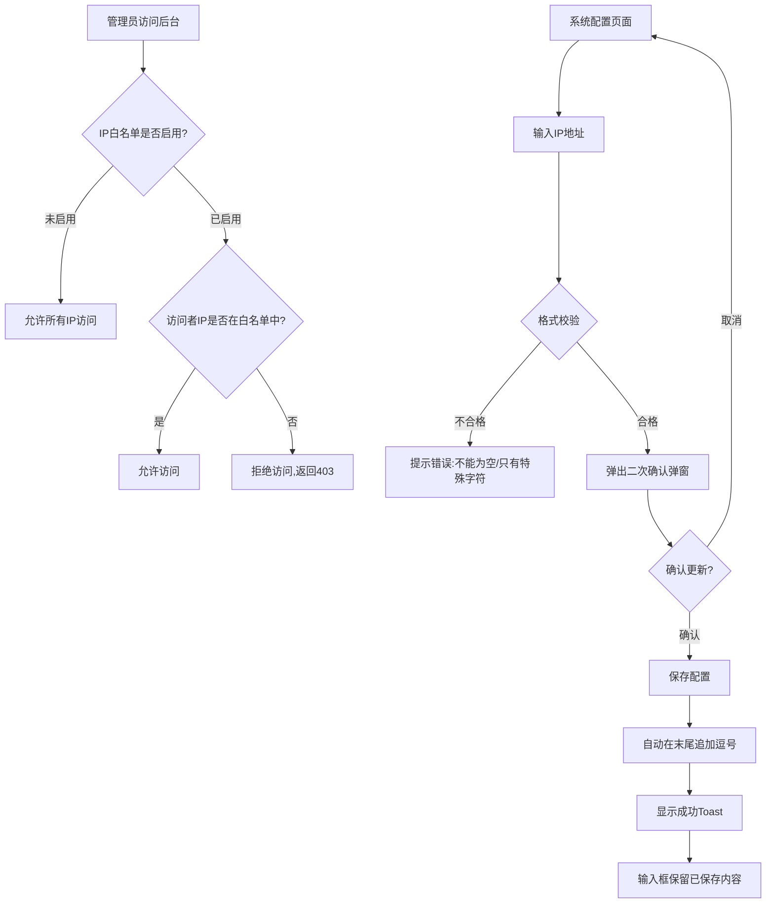

# PRD-002: IP白名单配置与后台访问控制

**版本：** v1.0  
**日期：** 2026-05-14  
**涉及仓库：** ---   
**优先级：** P2  
**作者：** Bawan

## 1. 文档概览

- **产品名称：** HashRace Platform 管理后台系统
- **功能名称：** IP白名单配置与后台访问控制
- **目标：** 通过IP白名单机制实现**系统最高级安全权限控制**，仅允许名单内的IP地址访问管理后台（平台、预测）为线上做准备，防止未授权访问和暴力攻击。

## 2. 业务流程图

> 现状约束（来自 `platform-admin-api`）：
> - 当前系统**无IP白名单限制**，所有IP均可访问管理后台登录页
> - 需要在**网关层或应用层**实现IP拦截，确保配置生效后立即阻断未授权IP
> - IP白名单配置需存储在**高可用、低延迟的存储介质**（如Redis），避免影响正常访问性能

## 3. 功能详细需求

### 3.1 IP白名单规则与格式要求

考虑到涉及系统最高安全权限，IP配置需要严格的格式校验：

- **格式要求：** 支持IPv4地址，使用英文逗号分隔多个IP
  - 单个IP示例：`192.168.1.1`
  - 多个IP示例：`192.168.1.1,10.0.0.1,172.16.0.1`
- **字符限制：** 只允许ASCII字符（数字、英文字母、英文符号），**禁止中文字符和中文标点**
- **特殊字符处理：** 
  - 逗号前后**不允许有空格**，保存时自动清理为紧凑格式
  - 每次保存成功后，自动在末尾追加英文逗号，方便下次追加新IP
- **增量提交策略：** 
  - 系统追踪上次保存的内容
  - 再次提交时，确认弹窗只显示**本次新增的IP**，而非全部IP
  - 避免重复确认已保存的历史记录

### 3.2 输入校验规则

在用户提交配置前，必须通过以下校验：

| 校验项 | 规则 | 错误提示 |
|--------|------|---------|
| **非空校验** | 新增内容不能为空 | "⚠️ 提交内容不能为空 请输入有效的IP地址" |
| **特殊字符校验** | 不能只包含逗号、空格、点等特殊字符 | "⚠️ 不能只提交特殊字符 请输入有效的IP地址 示例：192.168.1.1, 10.0.0.1" |
| **中文字符校验** | 不允许包含中文字符或中文标点 | "⚠️ 检测到中文字符 请只使用英文字符和英文符号 示例：192.168.1.1, 10.0.0.1" |
| **实时过滤** | 输入过程中自动删除非ASCII字符 | 无提示（实时处理） |

### 3.3 二次确认流程

为防止误操作导致管理员自身被锁定，**每次更新前必须二次确认**：

#### 确认弹窗内容

- **标题：** "确认更新IP白名单"
- **图标：** ⚠️ 警告图标（黄色）
- **正文：**
  - "您即将更新IP白名单配置。此操作将影响系统安全访问控制，请确认以下IP地址正确无误："
  

#### 弹窗交互规则

- 点击遮罩层可关闭弹窗
- 按ESC键可关闭弹窗
- 点击【取消】按钮关闭弹窗
- 点击【确认更新】后执行保存操作

### 3.4 保存成功后的处理

#### 后端处理逻辑

1. **格式化处理：** 
   - 清理所有逗号前后的空格（`192.168.1.1 , 10.0.0.1` → `192.168.1.1,10.0.0.1`）
   - 在配置末尾自动追加逗号（`192.168.1.1,10.0.0.1` → `192.168.1.1,10.0.0.1,`）
2. **存储更新：** 将清理后的IP列表写入Redis或数据库
3. **配置生效：** 网关层或中间件层立即读取最新配置，开始拦截非白名单IP

#### 前端反馈

- **输入框：** 保留本次保存后的内容（含末尾逗号），方便追加
- **Toast提示：** 居中显示"✓ 更新成功"（2秒后自动消失）
- **剪贴板：** 自动复制本次新增的IP（不含末尾逗号）到剪贴板

## 4. 页面原型设计（见原型图示例）

## 5. 异常处理与安全策略

| 异常场景 | 处理逻辑 |
|---------|---------|
| 用户输入中文逗号 | 实时过滤，中文字符无法输入 |
| 提交内容为空 | 前端拦截，Alert提示："⚠️ 提交内容不能为空" |
| 提交内容只有特殊字符 | 前端拦截，Alert提示："⚠️ 不能只提交特殊字符" |
| 包含空格的逗号分隔 | 保存时后端自动清理，`192.168.1.1 , 10.0.0.1` → `192.168.1.1,10.0.0.1,` |
| 管理员当前IP不在白名单 | **无强制拦截**（避免误操作锁死自己），但建议在UI增加检测提示："⚠️ 检测到您当前IP（x.x.x.x）不在白名单中，保存后您将无法访问" |
| 保存期间网络失败 | Toast提示"❌ 保存失败，请重试"，不改变输入框内容 |

所有IP白名单配置的修改操作，需记录到**操作审计日志**：

| 字段 | 说明 |
|------|------|
| `operation_type` | `ip_whitelist_update` / `ip_whitelist_reset` |
| `operator_uid` | 操作管理员UID |
| `operator_ip` | 操作者IP |
| `new_value` | 增删的的IP |
| `timestamp` | 操作时间（UTC） |

## 7. 验收标准（QA）

### 7.1 基础功能验收

- [ ] **页面加载时，能正确显示当前已保存的IP配置**
- [ ] **用户输入中文字符时，字符无法进入输入框（实时过滤生效）**
- [ ] **用户输入英文逗号前后有空格时，保存后自动清理为紧凑格式**
- [ ] **每次保存成功后，输入框末尾自动追加英文逗号**
- [ ] **提交空内容时，弹出Alert提示"提交内容不能为空"**
- [ ] **提交只包含特殊字符时，弹出Alert提示"不能只提交特殊字符"**

### 7.2 增量提交验收

- [ ] **首次保存`192.168.1.1`后，输入框显示`192.168.1.1,`**
- [ ] **追加输入`10.0.0.1`后，点击"立即更新"，确认弹窗只显示`10.0.0.1`（不显示`192.168.1.1`）**
- [ ] **确认更新后，输入框显示`192.168.1.1,10.0.0.1,`**
- [ ] **剪贴板中的内容为本次新增的IP（如`10.0.0.1`），不含逗号**

### 7.3 二次确认验收

- [ ] **点击"立即更新"后，弹出确认弹窗，显示本次新增的IP**
- [ ] **弹窗中IP预览区域使用等宽字体**
- [ ] **新增IP为空时，预览区域显示红色文字"（未设置任何IP，系统将允许所有IP访问）"**
- [ ] **点击遮罩层可关闭弹窗**
- [ ] **按ESC键可关闭弹窗**
- [ ] **点击【取消】按钮关闭弹窗，不执行保存**
- [ ] **点击【确认更新】后，弹窗关闭并执行保存**

 

## 8. 权限控制

### 8.1 功能权限

| 操作 | 权限标识 | 说明 |
|------|---------|------|
| **查看IP白名单配置** | `system:ip_whitelist:read` | 可查看当前配置，无法修改 |
| **修改IP白名单配置** | `system:ip_whitelist:write` | 可添加、修改、删除IP地址 |
 超级管理员有此权限 根据角色进行自行分配

### 8.2 角色权限建议

| 角色 | 权限组合 | 典型场景 |
|------|---------|---------|
| **超级管理员** | `read` + `write` + `reset` | 完全控制IP白名单 |
| **无权限的用户** | 无权限 | 完全不可见IP白名单配置入口 |

