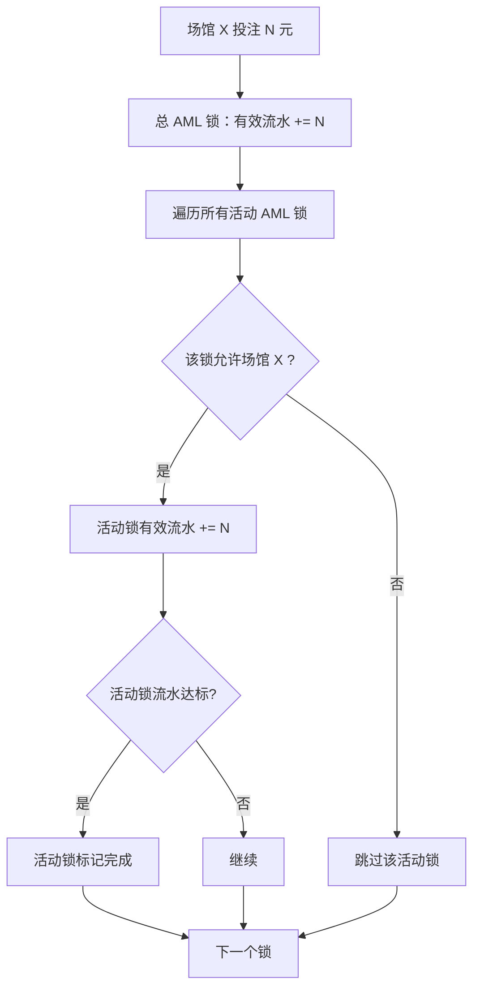
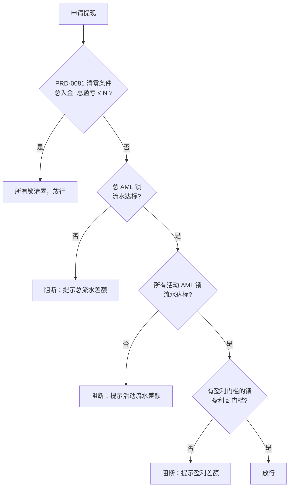

# PRD-009：优惠券场馆限制（方案 A — 单钱包 + 双 AML 锁）

**状态：** 评审稿  
**日期：** 2026-05-29  
**作者：** bawan  
**关联：** PRD-0081 AML 锁

---

## 一、为什么要做

现有优惠券全平台通用，运营无法定向推广指定场馆。彩金可在任意场馆刷流水，活动效果无法归因，风控粒度不够。

本方案引入**双 AML 锁模型**：充值产生**总 AML 锁**，彩金产生**活动 AML 锁**（带场馆限制）。在允许场馆投注同时消减两个锁的流水，在非允许场馆只消减总 AML。两个锁都完成才可提现。用户进入非允许场馆时全额转入（与现有行为一致），场馆限制仅通过活动 AML 锁的流水归属实现。清零规则、锚点机制仍遵循 PRD-0081。

---

## 二、做什么 / 不做什么

**做：** 发券时可配允许场馆和盈利门槛；双锁流水归属（允许场馆消减双锁，非允许场馆仅消减总 AML）；用户端展示场馆标签和进度。

**不做：** 不改钱包结构；不改总 AML 锁的清零/锚点逻辑；不做场馆内资金隔离；不做彩金盈亏拆分。

---

## 三、关键概念

| 概念 | 说明 |
|------|------|
| 总 AML 锁 | 充值产生，全场馆投注均可消减，遵循 PRD-0081 |
| 活动 AML 锁 | 彩金产生，仅在**允许场馆**的投注才可消减 |
| 允许场馆 | 发券时指定，留空 = 全平台（兼容现有） |
| 盈利门槛 | 彩金可额外配置的提现条件：总盈利 ≥ N 才放行（区别于流水要求） |

**双锁关系：** 彩金金额计入 PRD-0081 的总入金（同时产生总 AML 锁额度）。彩金额外产生一个活动 AML 锁（带场馆限制和流水倍数）。两个锁独立追踪，**都完成才能提现**。

---

## 四、核心规则

### 4.1 发券配置（后台新增）

现有发券页新增字段：

- **允许场馆**（多选下拉）—— 留空 = 全平台通用
- **流水倍数**（数字）—— 活动 AML 锁的流水要求 = 彩金面额 × 倍数
- **盈利门槛**（数字）—— 总盈利 ≥ 此值才可提现，0 = 无门槛

### 4.2 流水归属（双锁消减）

| 投注场馆 | 总 AML 锁 | 活动 AML 锁 |
|----------|----------|------------|
| 允许场馆 | ✓ 消减 | ✓ 消减 |
| 非允许场馆 | ✓ 消减 | ✗ 不消减 |

- 一笔投注可同时推进多个锁（总 AML + 多个活动 AML）
- 活动 AML 锁只认允许场馆内的投注

### 4.3 提现校验

提现时依次检查：

1. **PRD-0081 清零条件**：总入金 − 总盈亏 ≤ N → 所有锁清零，直接放行
2. **总 AML 锁**：流水是否达标？
3. **活动 AML 锁**：流水是否达标？
4. **盈利门槛**：有门槛的活动锁，总盈利 ≥ 门槛？

任一未满足 → 阻断，提示具体差额。**流水拦截和盈利门槛拦截分别在各自的校验环节提示。**

### 4.4 清零联动

完全遵循 PRD-0081：总入金 − 总盈亏 ≤ N 时，**总 AML 锁 + 所有活动 AML 锁**一并清零，设新锚点。不另设清零条件。

---

## 五、用户端展示

| 位置 | 展示 |
|------|------|
| 优惠券卡片 | 场馆标签"仅限 PG 电子" |
| 领取弹窗 | 规则说明：场馆 / 流水 / 盈利门槛 |
| 我的优惠 | 流水进度条 + 盈利达标状态 + 剩余天数 |
| 提现阻断（盈利门槛） | 弹窗提示"盈利未达到门槛"+ 具体差额 + "我知道了" |

---

## 六、流程图

### 6.1 投注流水归属（双锁）

### 6.2 提现校验

---

## 七、举例说明

### 例 1：正常领取 + 充值 + 完成双锁

> 彩金 66（限 PG 电子，5 倍流水=330，盈利门槛 388）；充值 100（总 AML 1 倍=100）

| 步骤 | 操作 | 总余额 | 活动 AML（0/330） | 总 AML（0/100） | 能否提现 |
|------|------|--------|-----------------|---------------|---------|
| 1 | 领取 66 彩金 | 66 | 0/330 | — | 否 |
| 2 | 充值 100 | 166 | 0/330 | 0/100 | 否 |
| 3 | 进 PG 电子，投注 200 | — | **200/330** | **200/100 ✓** | 否（活动锁未完成） |
| 4 | 继续 PG 电子，投注 130 | 216 | **330/330 ✓** | ✓ | 否（盈利门槛） |
| 5 | 继续玩，盈利涨到 420 | 420 | ✓ | ✓ | ✓ 盈利 420 ≥ 388 |

**关键：** PG 电子投注同时消减总 AML 和活动 AML，所以总 AML 先完成。

### 例 2：非允许场馆投注（只消减总 AML）

> 同上彩金 66（限 PG 电子），充值 100，总余额 166

| 步骤 | 操作 | 总 AML（0/100） | 活动 AML（0/330） | 说明 |
|------|------|----------------|-----------------|------|
| 1 | 棋牌投注 80 | **80/100** | **0/330（不变）** | 棋牌非允许场馆，不消减活动 AML |
| 2 | 棋牌投注 20 | **100/100 ✓** | **0/330（不变）** | 总 AML 完成，活动 AML 仍为 0 |
| 3 | 转去 PG 电子，投注 330 | ✓ | **330/330 ✓** | 允许场馆，同时消减双锁 |

**关键：** 非允许场馆的投注只推进总 AML，不推进活动 AML。用户必须回到允许场馆才能完成活动 AML。

### 例 3：多张不同场馆彩金

> 彩金 A：66（限 PG 电子，5 倍=330）；彩金 B：88（限棋牌，5 倍=440）；充值 100。总余额 254

| 在哪投注 | 总 AML | 活动锁 A（PG 电子） | 活动锁 B（棋牌） |
|----------|--------|-------------------|----------------|
| PG 电子投注 | ✓ 消减 | ✓ 消减 | ✗ 不消减 |
| 棋牌投注 | ✓ 消减 | ✗ 不消减 | ✓ 消减 |
| 自营游戏投注 | ✓ 消减 | ✗ 不消减 | ✗ 不消减 |

### 例 4：输光触发清零（双锁一并释放）

> 彩金 66（限 PG 电子），充值 100，总余额 166。总入金 = 166

| 步骤 | 操作 | 总余额 | 总入金 − 总盈亏 | 锁状态 |
|------|------|--------|----------------|--------|
| 1 | PG 电子持续输，亏 160 | 6 | 166 − 160 = 6 | 未清零（> 5） |
| 2 | 再输 3 | 3 | 166 − 163 = 3 | **≤ 5 → 清零**，总 AML + 活动 AML 一并释放 |
| 3 | 设新锚点 | 3 | — | 无锁，可提现 |
| 4 | 充值 200 | 203 | 新锚点：总入金 200 | 仅产生新总 AML 锁 |

---

## 八、边界情况

| 场景 | 处理 |
|------|------|
| 在允许场馆输光了 | 活动锁仍活跃，但不阻碍操作。满足清零条件时一并清零 |
| 非允许场馆投注很多 | 只消减总 AML，不消减活动 AML，两个锁独立追踪 |
| 多张彩金限同一场馆 | 各自独立追踪活动锁 |
| 多张彩金限不同场馆 | 投注消减总 AML + 该场馆对应的活动锁 |
| 运营中途改允许场馆 | 仅对新领取用户生效，已领取不变 |
| 允许场馆维护中 | 不影响锁状态，恢复后继续 |
| 存量老优惠券 | 允许场馆为空 = 全平台，行为不变 |
| 用户不想玩了 | **现金被活动锁锁住**，需等活动 AML 达标或清零条件触发后才能提现 |
| 历史余额 | 不受影响，上线前无活动 AML 锁 |

---

## 九、验收标准

### 配置与展示

- [ ] 发券时可多选允许场馆，留空 = 全平台通用
- [ ] 可设置流水倍数、盈利门槛
- [ ] 用户端优惠券卡片展示场馆标签
- [ ] 领取弹窗展示完整规则（场馆 / 流水 / 盈利门槛）
- [ ] 我的优惠展示流水进度和盈利达标状态

### 双锁流水

- [ ] 允许场馆投注**同时消减**总 AML 锁和活动 AML 锁
- [ ] 非允许场馆投注**仅消减**总 AML 锁，活动 AML 锁不变
- [ ] 一笔投注可同时推进多个锁
- [ ] 总 AML 和活动 AML 各自独立追踪进度

### 提现校验

- [ ] 总 AML 锁未完成 → 阻断（由现有流水拦截处理）
- [ ] 活动 AML 锁未完成 → 阻断（由现有流水拦截处理）
- [ ] 盈利门槛未满足 → 阻断，弹窗提示盈利差额 + "我知道了"
- [ ] 双锁都完成 + 盈利达标 → 放行

### AML 联动

- [ ] 彩金计入 PRD-0081 总入金
- [ ] 彩金产生独立的活动 AML 锁（带场馆限制）
- [ ] 总入金 − 总盈亏 ≤ N 时，总 AML + 所有活动 AML 一并清零
- [ ] 清零后设新锚点，后续按 PRD-0081 重新累计
- [ ] 存量优惠券行为完全不变
