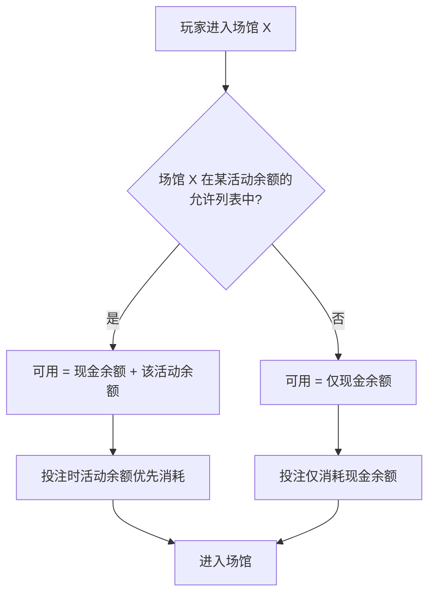
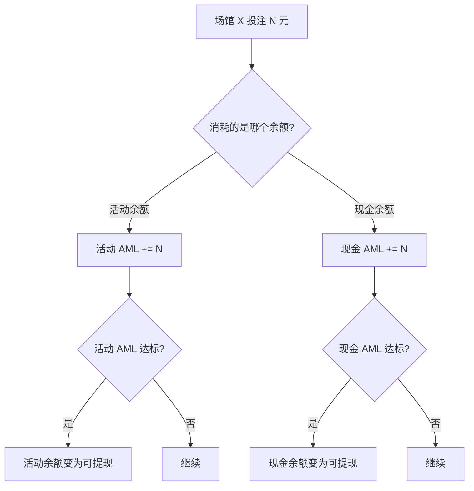
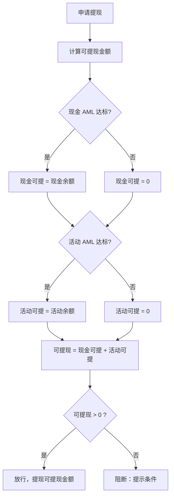
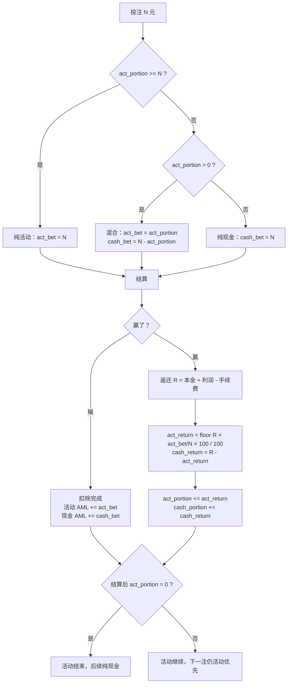

# PRD-009：优惠券场馆限制（方案 B — 双余额模型）

**状态：** 评审稿  
**日期：** 2026-05-29  
**作者：** bawan  
**关联：** PRD-0081 AML 锁

---

## 一、为什么要做

现有优惠券全平台通用，运营无法定向推广指定场馆。彩金可在任意场馆使用，活动效果无法归因。且现有单钱包方案下，用户领取彩金后若不想继续玩，现金余额也被锁住，体验差。

本 PRD 引入**双余额模型**：将用户钱包拆为**现金余额**和**活动余额**，两套独立控制。活动余额仅在指定场馆可用，完成流水后可提现；现金余额不受活动影响，正常走 PRD-0081 AML。用户不想玩了，现金随时可提（AML 达标即可），活动余额到期自动清空。

---

## 二、做什么 / 不做什么

**做：** 钱包增加活动余额；发券时配允许场馆和流水要求；活动余额仅在指定场馆使用且优先消耗；两套余额独立计算可提现金额；活动过期清空活动余额。

**不做：** 不改现金余额的 AML 逻辑；不限制用户充值；不做活动余额之间的合并（多张彩金各自独立）。

---

## 三、关键概念

| 概念 | 说明 |
|------|------|
| 现金余额 | 用户充值产生，全平台通用，受 PRD-0081 AML 控制 |
| 活动余额 | 彩金产生，仅在**允许场馆**可用，有独立流水要求 |
| 允许场馆 | 发券时指定，留空 = 全平台（兼容现有） |
| 可提现金额 | = 现金可提 + 活动可提，各项独立计算，未满足的 = 0 |

**双余额独立控制：**

```
可提现金额 = 现金可提 + 活动可提

现金可提 = 现金余额（需满足 PRD-0081 AML）
活动可提 = 活动余额（需满足活动 AML 要求）

任一项未满足，该项 = 0，但不阻断另一项
```

---

## 四、核心规则

### 4.1 发券配置（后台新增）

现有发券页新增字段：

- **允许场馆**（多选下拉）—— 留空 = 全平台通用
- **流水倍数**（数字）—— 活动 AML 要求 = 彩金面额 × 倍数
- **有效期**（天数）—— 到期自动清空活动余额
- 去掉盈利门槛（双余额模型下不再需要）

### 4.2 余额结构

用户钱包新增活动余额层：

```
总余额 = 现金余额 + 活动余额（可能有多个）

每个活动余额独立记录：
- 原始金额（彩金面额）
- 当前余额（游戏后的实际余额）
- 允许场馆
- 流水要求 / 已完成流水
- 到期时间
```

### 4.3 场馆进入与余额使用

用户进入场馆时：

| 场馆类型 | 可用余额 | 消耗优先级 |
|----------|---------|-----------|
| 允许场馆 | 现金余额 + 该活动余额 | **活动余额优先消耗** |
| 非允许场馆 | 仅现金余额 | 活动余额不可用 |

- 活动余额优先消耗：匹配场馆时先用活动余额投注，用完再用现金余额
- 活动余额内的盈亏归属活动余额（赢了加到活动余额，输了从活动余额扣）
- 活动余额用完 = 活动自然结束，不影响现金余额

### 4.4 流水归属

| 场景 | 现金 AML（PRD-0081） | 活动 AML |
|------|---------------------|---------|
| 用活动余额在允许场馆投注 | 不计入 | ✓ 计入 |
| 用现金余额在允许场馆投注 | ✓ 计入 | 不计入 |
| 用现金余额在非允许场馆投注 | ✓ 计入 | 不计入 |

- 流水归属跟着**消耗的余额类型**走，不跟场馆走
- 活动余额的投注只消减活动 AML，现金余额的投注只消减现金 AML

### 4.5 提现校验

```
可提现金额 = 现金可提 + 活动可提

现金可提：现金余额满足 PRD-0081 AML → 现金余额；否则 → 0
活动可提：活动 AML 达标 → 活动余额；否则 → 0
```

- 两项独立判断，互不阻断
- 用户充值 100、领彩金 66：即使彩金流水没刷完，100 的 AML 达标后现金仍可提
- 活动余额流水未达标时，仅活动部分不可提，不锁现金

### 4.6 活动结束条件

| 条件 | 处理 |
|------|------|
| 活动余额输完（= 0） | 活动自然结束，无残留 |
| 活动 AML 达标 | 活动余额变为可提现 |
| 有效期到期 | 清空活动余额，活动结束 |
| PRD-0081 清零条件满足 | 现金 AML 清零；活动余额独立，不受影响 |

### 4.7 场馆转入与混合投注机制

#### 4.7.1 转入规则

用户进入允许场馆时，平台将**全部可用余额一次性转入**游戏供应商：

```
转入金额 = 现金余额 + 活动余额（仅该场馆匹配的活动余额）
```

平台内部记录本次转入的余额构成：

```
act_portion = 活动余额部分
cash_portion = 现金余额部分
total = act_portion + cash_portion
```

游戏供应商只看到一个 total，**不感知双余额**，无需改供应商接口。

#### 4.7.2 投注消耗优先级

每笔投注按以下优先级扣除：

```
投注 N 元：
1. 先扣 act_portion：实际扣除 = min(act_portion, N)
2. 不够则扣 cash_portion：实际扣除 = min(cash_portion, N - 已扣活动)
3. AML 归属：活动部分 → 活动 AML；现金部分 → 现金 AML
```

**混合扣除**：当 act_portion 不足以覆盖整笔投注时，一笔投注会同时扣除两种余额。可理解为**活动 X 元 + 现金 Y 元同时下注**，合并在一笔投注中。

#### 4.7.3 按比例返还（核心）

投注结算后，返还金额按**投入比例**分配回两种余额：

```
一笔投注：act_bet = 11, cash_bet = 19, total_bet = 30
结算返还 = 本金 + 盈利 - 手续费 = 49

活动返还 = floor(49 × (11/30) × 100) / 100 = ¥17.96
现金返还 = 49 - 17.96 = ¥31.04（现金兜底尾差）
```

**精度规则：**

- 内部以**分（0.01）**为最小单位计算
- 活动部分**向下取整**（floor），避免活动余额多算
- 现金部分 = 总返还 - 活动返还（**兜底尾差**）
- 总数永远精确对齐，不会出现差额

**手续费分摊**：同样按投入比例分摊，活动部分 floor，现金兜底。

#### 4.7.4 活动结束判定时机

活动余额 = 0 的判定在**每注结算完成后**，不在扣除时：

```
投注扣除：act_portion 11 → 0（此时不判定结束）
     ↓
结算返还：按比例返还 → act_portion 可能回到 17.96
     ↓
结算完成：检查 act_portion
  ├── > 0 → 活动继续，下一注仍然活动优先
  └── = 0 → 活动结束，后续全部走现金
```

#### 4.7.5 转出规则

用户离开场馆时，剩余金额按 portion 拆分回各自余额：

```
转出：
├── act_portion 剩余 → 回到活动余额
└── cash_portion 剩余 → 回到现金余额
```

#### 4.7.6 完整举例（10 倍 AML）

> 现金 100（AML 1 倍 = 100），活动 66（限 PG 电子，AML 10 倍 = 660）
> 进入 PG 电子 → 转入 166（act=66, cash=100）

| # | 操作 | 扣谁 | act | cash | 活动 AML | 现金 AML | 说明 |
|---|------|------|:---:|:---:|:---:|:---:|------|
| 初始 | 转入 166 | — | 66 | 100 | 0/660 | 0/100 | |
| 1 | 投 30，输 | act-30 | 36 | 100 | 30/660 | 0/100 | 活动优先 |
| 2 | 投 20，赢 15 | act-20，返 35 | 51 | 100 | 50/660 | 0/100 | 36-20+35=51 |
| 3 | 投 40，输 | act-40 | 11 | 100 | 90/660 | 0/100 | |
| 4 | 投 30，输 | act-11 + cash-19 | **0** | **81** | 101/660 | 19/100 | 混合扣除 |
| 5 | 结算后 act=0 | — | 0 | 81 | 101/660 | 19/100 | 活动结束 |
| 6 | 投 20，赢 10 | cash-20，返 30 | 0 | 91 | — | 39/100 | 纯现金 |
| 7 | 投 50，输 | cash-50 | 0 | 41 | — | 89/100 | |
| 8 | 投 20，赢 15 | cash-20，返 35 | 0 | 56 | — | 100/100 ✓ | AML 达标 |
| 离开 | 转出 56 | — | 0 | 56→现金 | 作废 | ✓ | |

**结果：** 活动余额输完，活动 AML 101/660 作废。现金 56 可提。

**第 4 步混合投注若赢（对比）：**

| # | 操作 | 扣谁 | act | cash | 活动 AML | 现金 AML | 说明 |
|---|------|------|:---:|:---:|:---:|:---:|------|
| 4' | 投 30，赢 20 | act-11 + cash-19 | | | 101/660 | 19/100 | 混合投注 |
| | 返还 50 | 按比例 | **18.33** | **112.67** | | | act=floor(50×11/30×100)/100 |
| 5' | 结算后 act>0 | — | 18.33 | 112.67 | 101/660 | 19/100 | **活动续命！** |
| 6' | 投 18，输 | act-18 | 0.33 | 112.67 | 119/660 | 19/100 | 继续活动优先 |

---

## 五、用户端展示

| 位置 | 展示 |
|------|------|
| 钱包首页 | 分行显示：现金余额 / 活动余额（标注场馆） |
| 优惠券卡片 | 场馆标签"仅限 PG 电子" |
| 领取弹窗 | 规则说明：场馆 / 流水 / 有效期 |
| 我的优惠 | 活动余额 + 流水进度条 + 剩余天数 |
| 允许场馆内 | 显示：现金余额 + 活动余额，标注"活动余额优先使用" |
| 非允许场馆 | 仅显示现金余额 |
| 提现页 | 分行显示可提现金额：现金可提 X + 活动可提 Y = 总可提 Z |

---

## 六、流程图

### 6.1 场馆进入与余额分配



### 6.2 投注与流水归属



### 6.3 提现校验



### 6.4 混合投注与按比例返还



---

## 七、举例说明

### 例 1：正常领取 + 充值 + 双余额独立

> 彩金 66（限 PG 电子，5 倍流水=330）；充值 100

| 步骤 | 操作 | 现金余额 | 活动余额 | 现金 AML | 活动 AML | 可提现 |
|------|------|---------|---------|---------|---------|--------|
| 1 | 领取 66 彩金 | 0 | 66 | — | 0/330 | 0 |
| 2 | 充值 100 | 100 | 66 | 0/100 | 0/330 | 0 |
| 3 | 进 PG 电子，用活动余额投注 66，赢 34 | 100 | 100 | — | 66/330 | 0 |
| 4 | 继续用活动余额投注 264 | 100 | — | — | 330/330 ✓ | 活动可提 |
| 5 | 进任意场馆，用现金投注 100 | 100 | — | 100/100 ✓ | ✓ | 全部可提 |

**关键：** 活动余额在 PG 电子优先消耗。现金余额的 AML 独立，不受活动影响。

### 例 2：活动余额输完 = 活动结束

> 彩金 66（限 PG 电子），充值 100

| 步骤 | 操作 | 现金余额 | 活动余额 | 结果 |
|------|------|---------|---------|------|
| 1 | 进 PG 电子，用活动余额投注，全输光 | 100 | **0** | 活动自然结束 |
| 2 | 现金 AML 达标后 | 100 | 0 | 现金 100 可提，不受活动影响 |

**关键：** 活动余额输完，活动就结束了。现金余额完全不受影响。

### 例 3：不想玩了

> 彩金 66（限 PG 电子，7 天有效），充值 500

| 步骤 | 操作 | 现金余额 | 活动余额 | 可提现 |
|------|------|---------|---------|--------|
| 1 | 领取彩金，充值 500 | 500 | 66 | 0（AML 未完成） |
| 2 | 随便玩了几把，不想继续了 | 480 | 50 | 现金 AML 达标后 480 可提 |
| 3 | 第 7 天到期 | 480 | **清空 → 0** | 480 可提 |

**关键：** 用户不想玩了，现金随时可提（AML 达标即可）。活动余额到期自动清空，干净利落。

### 例 4：多张不同场馆彩金

> 彩金 A：66（限 PG 电子）；彩金 B：88（限棋牌）；充值 100

| 进入场馆 | 可用余额 | 优先消耗 |
|----------|---------|---------|
| PG 电子 | 现金 100 + 活动 A 66 = **166** | 活动 A 优先 |
| 棋牌 | 现金 100 + 活动 B 88 = **188** | 活动 B 优先 |
| 自营游戏 | 仅现金 **100** | 无活动余额 |

- 每个活动余额独立追踪，互不影响
- 同时只有一个活动余额在使用（当前场馆匹配的那个）

### 例 5：活动余额赢了很多

> 彩金 66（限 PG 电子，5 倍流水=330）

| 步骤 | 操作 | 活动余额 | 活动 AML | 可提现 |
|------|------|---------|---------|--------|
| 1 | PG 电子，66 投注赢到 500 | 500 | 200/330 | 0（流水未完成） |
| 2 | 继续投注 130 | 420 | 330/330 ✓ | 活动 420 可提 |

**关键：** 活动余额的盈亏都在活动余额内。流水达标后整个活动余额（含盈利）可提现。

### 例 6：活动过期

> 彩金 66（限 PG 电子，7 天有效），用户领取后玩了一半

| 步骤 | 操作 | 活动余额 | 结果 |
|------|------|---------|------|
| 1 | 玩了几天，活动余额剩 30，流水 150/330 | 30 | 继续 |
| 2 | 第 7 天到期 | **清空 → 0** | 活动结束，流水作废 |

---

## 八、边界情况

| 场景 | 处理 |
|------|------|
| 活动余额输完了 | 活动自然结束，现金不受影响 |
| 用户不想玩了 | 现金正常提（AML 达标），活动余额到期清空 |
| 活动余额赢了很多 | 盈利留在活动余额，流水达标后全部可提 |
| 多张彩金限同一场馆 | 各自独立活动余额，同场馆内按领取顺序优先消耗 |
| 多张彩金限不同场馆 | 进哪个场馆用哪个活动余额，互不干扰 |
| 活动余额 + 现金余额混合场馆 | 活动余额先用，用完再用现金 |
| 单笔投注混合扣除（活动不够） | 活动扣剩余 + 现金补差额，AML 分别计入 |
| 混合投注赢了 | 按投入比例返还，活动 floor 取整，现金兜底尾差 |
| 混合投注结算后活动余额 > 0 | 活动继续，下一注仍活动优先 |
| 混合投注结算后活动余额 = 0 | 活动结束，后续全部走现金 |
| 手续费分摊 | 同投入比例分摊，活动 floor，现金兜底 |
| 历史余额（上线前存量） | 全部视为现金余额，不受活动影响 |
| 充值不受活动影响 | 充值只进现金余额，活动余额独立 |
| 运营中途改允许场馆 | 仅对新领取用户生效，已领取不变 |
| 存量老优惠券 | 允许场馆为空 = 全平台，计入现金余额（兼容现有） |
| PRD-0081 清零 | 仅清零现金 AML，活动余额不受影响 |

---

## 九、验收标准

### 余额结构

- [ ] 钱包新增活动余额，与现金余额独立显示
- [ ] 领取彩金 → 计入活动余额（不影响现金余额）
- [ ] 充值 → 计入现金余额（不影响活动余额）
- [ ] 多张彩金各自独立活动余额

### 场馆与投注

- [ ] 进允许场馆 → 显示现金 + 活动余额，活动余额优先消耗
- [ ] 进非允许场馆 → 仅显示现金余额
- [ ] 活动余额投注 → 盈亏归属活动余额
- [ ] 现金余额投注 → 盈亏归属现金余额

### 流水归属

- [ ] 活动余额投注 → 计入活动 AML
- [ ] 现金余额投注 → 计入现金 AML（PRD-0081）
- [ ] 两套流水独立追踪，互不干扰

### 提现

- [ ] 可提现 = 现金可提（AML 达标）+ 活动可提（流水达标）
- [ ] 现金 AML 达标但活动未完成 → 现金部分可提
- [ ] 活动 AML 达标但现金 AML 未完成 → 活动部分可提
- [ ] 两项都未满足 → 分别提示各自差额

### 混合投注与按比例返还

- [ ] 活动余额不足时，单笔投注混合扣除（活动 + 现金补差额）
- [ ] 混合投注 AML 分别计入：活动部分 → 活动 AML，现金部分 → 现金 AML
- [ ] 混合投注赢利按投入比例返还：活动 floor 取整，现金兜底尾差
- [ ] 手续费按投入比例分摊，精度规则同上
- [ ] 活动结束判定在结算完成后，非扣除时
- [ ] 混合投注结算后 act > 0 → 活动继续；act = 0 → 活动结束
- [ ] 全程以分（0.01）为最小精度单位，总额无误差

### 活动结束

- [ ] 活动余额输完（结算后 = 0）→ 活动自然结束
- [ ] 活动 AML 达标 → 活动余额可提现
- [ ] 到期 → 清空活动余额
- [ ] 活动结束不影响现金余额和现金 AML

### 历史兼容

- [ ] 上线前存量余额全部视为现金余额
- [ ] 存量老优惠券（无场馆限制）领取后计入现金余额
- [ ] 无需数据迁移，对老用户无感
