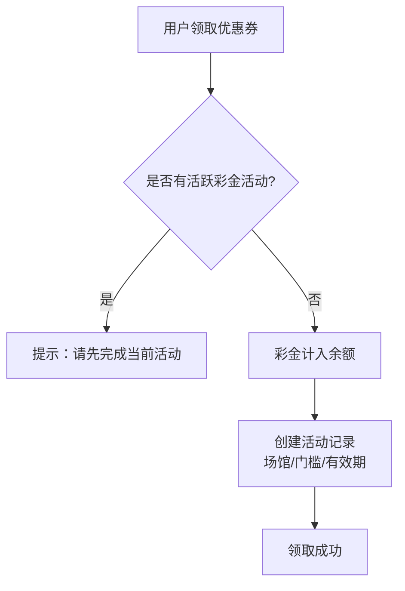
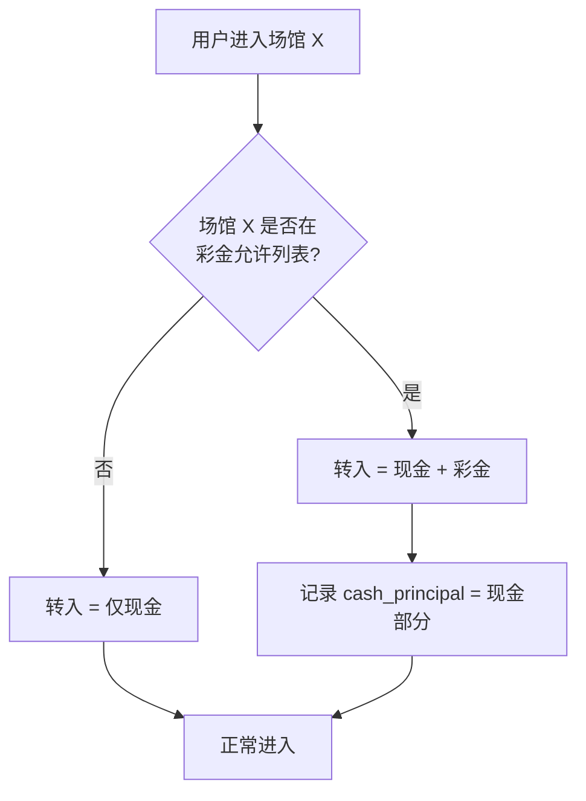
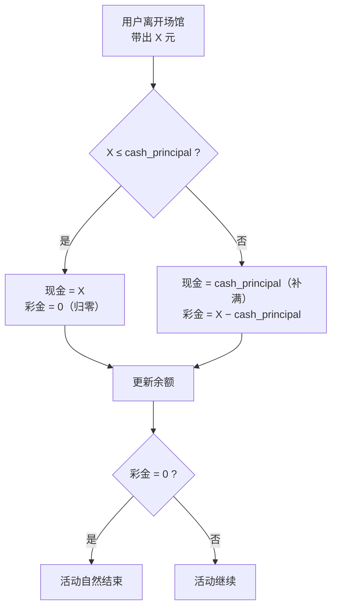
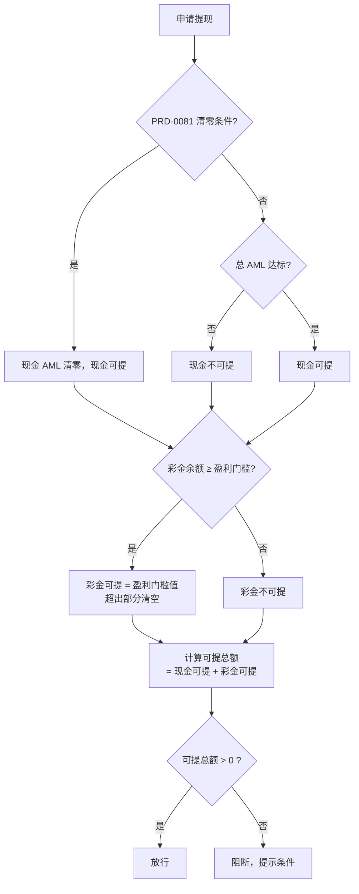
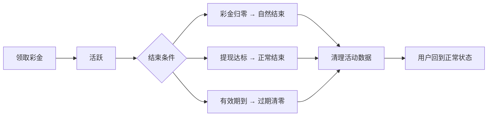

# PRD-0031：优惠券场馆限制 

**状态：** 评审稿 v2  
**日期：** 2026-06-02  
**作者：** bawan  
**关联：** [PRD-0081 AML 锁](https://hashrace.atlassian.net/wiki/spaces/Hashrace/pages/98616) · [PRD-003 优惠券中心](https://hashrace.atlassian.net/wiki/spaces/Hashrace/pages/1376734/PRD-+003) · [PRD-0032 代理锁](https://hashrace.atlassian.net/wiki/spaces/Hashrace/pages/10059841/PRD-0032)

---

## 一、为什么要做

现有活动模式（充 1000 送 888，33 倍流水）成本高、玩家接受度低。需要一种**低成本、表面大方、风控隐蔽**的彩金方案：

- 充 10 送 28，实际平台成本大幅降低
- 彩金必须在指定场馆盈利达到门槛（如 500）才能提现
- 大部分用户在达标前归零，少量达标用户提走上限金额
- 玩家无法计算平台成本，平台可精准核算

**核心思路：用"盈利门槛"替代传统的"打满流水"，更隐蔽、成本更低、且无需双流水计算。**

---

## 二、做什么 / 不做什么

**做：**

- 彩金发放时打标（绑定场馆、设定盈利门槛）
- 彩金只能带入指定场馆
- 转入转出记录现金本金，回补时现金优先
- 彩金盈利达到门槛才可提现，提现上限 = 盈利门槛
- 现金余额走原有 AML，完全不受活动影响
- 有效期到期自动清理

**不做：**

- 不拆分余额（不建双余额）
- 不新增 AML 锁类型（不做双 AML / 活动 AML）
- 不做场馆内资金比例分成
- 不复用现有冻结金额字段（避免与提现中金额混淆）
- 代理佣金冻结券不在本期（单独文档）

---

## 三、关键概念

| 概念 | 说明 |
|------|------|
| 现金余额 | 用户充值产生，全平台通用，受 PRD-0081 AML 控制，逻辑完全不改 |
| 彩金余额 | 活动发放，打标绑定指定场馆，有盈利门槛 |
| 盈利门槛 | 彩金余额 ≥ 此值（如 500）才可提现，同时也是提现上限 |
| 现金本金记录 | 转入场馆时记录带入的现金金额（cash_principal），转出时优先回补现金 |

**单余额 + 打标：** 底层仍是一个余额，彩金通过标识区分。不新建余额类型，做的是减法——原来 type=全平台，现在 type=指定场馆。

---

## 四、核心规则

### 4.1 发券配置（后台）

现有发券页新增字段：

| 字段 | 说明 | 示例 |
|------|------|------|
| 允许场馆 | 多选，彩金只能带入这些场馆 | PG 电子 |
| 盈利门槛 | 彩金余额 ≥ 此值才可提现，同时也是提现上限 | 500 |
| 有效期 | 天数，到期自动清理 | 7 天 |

### 4.2 领取彩金

用户领取后：

1. 彩金金额计入用户余额
2. 创建活动记录：{彩金金额, 当前彩金余额, 允许场馆, 盈利门槛, 有效期, 状态=活跃}
3. **不产生额外 AML 锁**——彩金流水计入总 AML（PRD-0081），不单独设活动 AML
4. 同一用户同时只能有一个活跃彩金活动（互斥），新活动需等旧活动结束或清理

### 4.3 AML 规则（不改）

| 投注来源 | 总 AML（PRD-0081） |
|----------|-------------------|
| 现金投注（任何场馆） | ✓ 计入 |
| 彩金投注（允许场馆） | ✓ 计入 |

所有投注都计入同一个总 AML，没有第二个锁。AML 只控制现金余额的提现，与彩金无关。

### 4.4 场馆转入规则

用户进入场馆时：

| 场馆类型 | 转入金额 | 系统记录 |
|----------|---------|---------|
| 允许场馆 | 现金余额 + 彩金余额（全额） | `cash_principal` = 当时的现金余额 |
| 非允许场馆 | 仅现金余额 | 彩金不可带入 |

每次进入允许场馆都重新记录当时的 `cash_principal`。

### 4.5 场馆转出规则（现金优先回补）

用户离开场馆时，按以下规则拆分：

```
转出金额 = X

若 X ≤ cash_principal：
    现金回补 = X
    彩金回补 = 0（彩金部分归零）

若 X > cash_principal：
    现金回补 = cash_principal（补满）
    彩金回补 = X - cash_principal（剩余归彩金）
```

**彩金不设转出上限**，超过盈利门槛的部分在**提现时**才处理（不在转出时清空），保护用户利益。

**举例：** 充 100 送 68，共 168 进入 PG 电子，cash_principal = 100

| 带出金额 | 现金回补 | 彩金回补 | 说明 |
|----------|---------|---------|------|
| 80 | 80 | 0 | 亏了 88，现金只回来 80，彩金归零 |
| 100 | 100 | 0 | 刚好回本，彩金全输了 |
| 168 | 100 | 68 | 没赢没亏，各回各的 |
| 350 | 100 | 250 | 赢了 182，彩金 250 但 < 500 不可提 |
| 600 | 100 | 500 | 赢了 432，彩金 500 达标可提 |
| 800 | 100 | 700 | 赢了 632，彩金 700 保留，提现时封顶 500 |

### 4.6 提现校验

提现时分两部分独立判断：

```
可提现金额 = 现金可提 + 彩金可提

现金可提：总 AML 达标 → 现金余额；否则 → 0
彩金可提：彩金余额 ≥ 盈利门槛 → 盈利门槛值（如 500）；否则 → 0

提现彩金时：扣除盈利门槛值，超出部分清空
两部分互不阻断
```

| 条件 | 现金 | 彩金 | 说明 |
|------|------|------|------|
| AML 未完成，彩金 < 500 | 不可提 | 不可提 | 继续玩 |
| AML 完成，彩金 < 500 | **可提** | 不可提 | 现金先走，不被彩金卡住 |
| AML 未完成，彩金 ≥ 500 | 不可提 | **可提 500** | 彩金达标先走 |
| AML 完成，彩金 ≥ 500 | **可提** | **可提 500** | 全部放行 |

**彩金提现时：** 用户提走 500（盈利门槛值），剩余彩金余额清空，活动结束。

### 4.7 有效期与自动清理

| 事件 | 行为 |
|------|------|
| 有效期内 | 彩金可带入指定场馆正常游戏 |
| 有效期到期 | ⚠️ 待定：立即清零 or 缓冲期后清零（见待定事项） |

### 4.8 活动结束条件

| 条件 | 处理 |
|------|------|
| 彩金余额归零（场馆内输光） | 活动自然结束 |
| 彩金提现成功（达标提走 500） | 活动正常结束，剩余清空 |
| 有效期到期 | 清零彩金，活动结束 |

活动结束后：清除活动记录、cash_principal 字段归位，用户回到正常状态。

---

## 五、流程图

### 5.1 领取彩金



### 5.2 场馆转入



### 5.3 场馆转出（现金优先回补）



### 5.4 提现校验



### 5.5 活动生命周期



---

## 六、举例说明

### 例 1：标准流程 — 充值 + 领彩金 + 盈利达标

> 充 100（AML 1倍=100），送 68 彩金（限 PG 电子，盈利门槛 500）

| 步骤 | 操作 | 现金 | 彩金 | 总 AML | 能否提现 |
|------|------|------|------|--------|---------|
| 1 | 充值 100 + 领取 68 | 100 | 68 | 0/100 | 否 |
| 2 | 进 PG（转入 168，cp=100） | — | — | — | — |
| 3 | 一路赢，带出 600 | 100 | 500 | 100/100 ✓ | 现金 ✓ 彩金 ✓ |
| 4 | 提现 | 提 100 | 提 500 | — | 共提 600 |

### 例 2：大部分用户的结局 — 彩金归零

> 充 10，送 28 彩金（限电子，盈利门槛 500）

| 步骤 | 操作 | 现金 | 彩金 | 说明 |
|------|------|------|------|------|
| 1 | 进电子（转入 38，cp=10） | — | — | |
| 2 | 一直玩，带出 5 | 5 | 0 | 亏 33，现金 5，彩金归零 |
| 3 | 活动自然结束 | 5 | 0 | 平台成本约 2~3 元 |

### 例 3：现金不被彩金绑架

> 充 100 送 68 彩金，用户不想玩电子

| 步骤 | 操作 | 现金 | 彩金 | 说明 |
|------|------|------|------|------|
| 1 | 去棋牌打 100 流水 | 90 | 68 | 彩金完全不动 |
| 2 | 申请提现 | **90 可提** | 不可提 | 现金 AML 达标放行 |
| 3 | 有效期到彩金清零 | 90 | 0 | 干净 |

### 例 4：后续充值不受影响

> 领了 68 彩金（门槛 500），后续又充值 500

| 步骤 | 操作 | 现金 | 彩金 | 说明 |
|------|------|------|------|------|
| 1 | 初始 | 100 | 68 | |
| 2 | 再充 500 | **600** | 68 | 充值只进现金 |
| 3 | 现金 AML 打完 | 600 可提 | 68 不可提 | 互不影响 |

### 例 5：多次进出场馆

> 充 100 送 68，多次进出 PG 电子

| 步骤 | 操作 | 现金 | 彩金 | cp 记录 |
|------|------|------|------|---------|
| 1 | 进 PG（cp=100） | — | — | 100 |
| 2 | 带出 250 → 现金 100 + 彩金 150 | 100 | 150 | — |
| 3 | 充值 200 | 300 | 150 | — |
| 4 | 再进 PG（cp=300） | — | — | 300 |
| 5 | 带出 800 → 现金 300 + 彩金 500 | 300 | 500 | — |
| 6 | 提现 | 300 | 500 | 彩金达标！ |

### 例 6：超出盈利门槛（提现时处理）

> 充 100 送 68，进 PG 大赢

| 步骤 | 操作 | 现金 | 彩金 | 说明 |
|------|------|------|------|------|
| 1 | 进 PG（cp=100），带出 900 | 100 | 800 | 彩金 800 保留 |
| 2 | 提现 | 提 100 | 提 500（清空剩余 300） | 彩金封顶 500 |

### 例 7：零现金 + 纯彩金游戏

> 充 10 送 28，现金在棋牌输光了

| 步骤 | 操作 | 现金 | 彩金 | 说明 |
|------|------|------|------|------|
| 1 | 棋牌输光 | 0 | 28 | |
| 2 | 进 PG（cp=0），带入 28 | — | — | 纯彩金 |
| 3 | 赢到 500，带出 500 | 0 | 500 | cp=0 全归彩金 |
| 4 | 提现 | 0 | 提 500 | 彩金达标！ |

---

## 七、边界情况

| 场景 | 处理 |
|------|------|
| 彩金在允许场馆全输了 | 活动自然结束，现金不受影响 |
| 彩金赢到 ≥ 500 | 达标可提，提现时封顶盈利门槛值，超出清空 |
| 彩金赢了但 < 500 | 不可提，继续玩或等过期清零 |
| 用户只玩非允许场馆 | 彩金完全不动，现金正常玩正常提 |
| 后续充值 | 只进现金余额，不影响彩金 |
| 有效期到了还有彩金 | ⚠️ 待定：清理方式 |
| 两个活动同时领 | 互斥，必须先完成当前活动 |
| PRD-0081 清零条件触发 | 只清现金 AML，彩金活动独立不受影响 |
| 转入时只有彩金无现金 | cash_principal = 0，转出全部回补彩金 |
| 允许场馆维护中 | 不影响活动状态，恢复后继续 |
| 存量老优惠券（无场馆限制） | 无打标，行为不变，完全兼容 |
| 彩金超 500 不在转出时清 | 保留，提现时才封顶 500 并清空超出部分 |

---

## 八、待定事项

### ⚠️ 有效期到期清理方式

**选项 A：立即清零**
- 有效期到 → 彩金余额立即清零 + 活动数据清除
- 优点：简单干净
- 缺点：用户可能感到突兀

**选项 B：缓冲期后清零**
- 有效期到 → 彩金不可再带入游戏（标记过期）
- 缓冲 N 天后 → 定时器自动清零
- 优点：用户有感知过渡
- 缺点：多一个状态、多一个定时器

**待评审确认。**

---

## 九、与现有系统的关系

| 现有功能 | 影响 |
|----------|------|
| 余额结构 | **不改**，不拆分，不新增余额类型 |
| 现有冻结字段 | **不复用**，避免与提现中金额混淆 |
| AML 锁（PRD-0081） | **不改**，彩金流水计入总 AML，不新增活动 AML |
| 清零条件 | **不改**，只影响现金 AML，不影响彩金活动 |
| 游戏供应商接口 | **不改**，供应商只看到一个总余额 |

**新增：** 活动记录表（彩金状态、允许场馆、盈利门槛、有效期）+ 转入时 `cash_principal` 字段。

---

## 十、验收标准

### 发券与领取

- [ ] 后台可配：允许场馆、盈利门槛（=提现上限）、有效期
- [ ] 用户领取后彩金计入余额，创建活动记录
- [ ] 同一用户同时只能有一个活跃彩金活动（互斥）
- [ ] 彩金流水计入总 AML，不新增活动 AML 锁

### 场馆转入转出

- [ ] 进允许场馆 → 现金 + 彩金全额转入，记录 cash_principal
- [ ] 进非允许场馆 → 仅现金转入，彩金不可带入
- [ ] 多次进出允许场馆，每次重新记录 cash_principal
- [ ] 转出 ≤ cash_principal → 全部回补现金，彩金归零
- [ ] 转出 > cash_principal → 现金补满，剩余归彩金
- [ ] 转出时不清空超出盈利门槛的部分（提现时才处理）

### 提现

- [ ] 现金可提：总 AML 达标 → 现金余额可提
- [ ] 彩金可提：彩金余额 ≥ 盈利门槛 → 提走盈利门槛值
- [ ] 彩金提现时超出部分清空，活动结束
- [ ] 两部分互不阻断，各自独立判断
- [ ] 彩金 < 盈利门槛 → 不可提，不影响现金

### 活动结束与清理

- [ ] 彩金归零 → 活动自然结束
- [ ] 彩金提现达标 → 活动正常结束，剩余清空
- [ ] 有效期到期 → ⚠️ 待定
- [ ] 活动结束后清除活动记录和 cash_principal
- [ ] 清理后用户回到正常状态，无残留

### 展示

- [ ] 钱包展示彩金余额 + 盈利门槛进度
- [ ] 允许场馆内显示总余额（现金+彩金），非允许场馆仅显示现金
- [ ] 提现页分行展示现金可提 + 彩金可提
- [ ] 优惠券卡片标注场馆 + 盈利门槛
