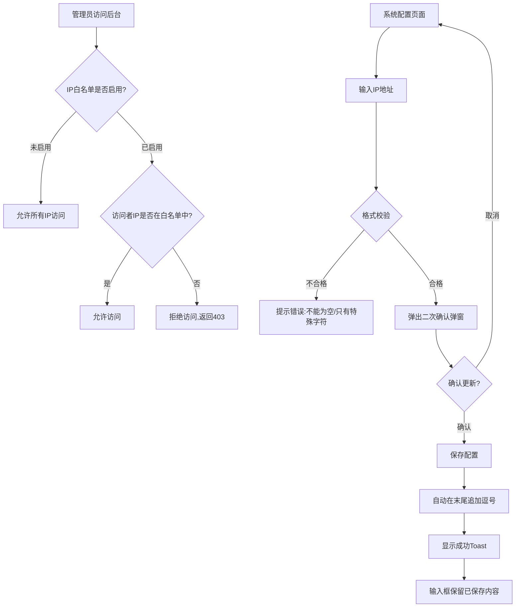

# PRD-002: IP白名单配置与后台访问控制

**状态：** 草稿  
**日期：** 2026-05-14  
**涉及仓库：** hashrace/platform-admin-api、hashrace/platform-admin-interface  
**优先级：** P0（高）  
**作者：** 李大壮

## 1. 文档概览

- **产品名称：** HashRace Platform 管理后台系统
- **功能名称：** IP白名单配置与后台访问控制
- **目标：** 通过IP白名单机制实现**系统最高级安全权限控制**，仅允许名单内的IP地址访问管理后台，防止未授权访问和暴力攻击。

## 2. 业务流程图



> 现状约束（来自 `platform-admin-api`）：
> - 当前系统**无IP白名单限制**，所有IP均可访问管理后台登录页
> - 需要在**网关层或应用层**实现IP拦截，确保配置生效后立即阻断未授权IP
> - IP白名单配置需存储在**高可用、低延迟的存储介质**（如Redis），避免影响正常访问性能

## 3. 功能详细需求

### 3.1 IP白名单规则与格式要求

考虑到涉及系统最高安全权限，IP配置需要严格的格式校验：

- **格式要求：** 支持IPv4地址，使用英文逗号分隔多个IP
  - 单个IP示例：`192.168.1.1`
  - 多个IP示例：`192.168.1.1,10.0.0.1,172.16.0.1`
- **字符限制：** 只允许ASCII字符（数字、英文字母、英文符号），**禁止中文字符和中文标点**
- **特殊字符处理：** 
  - 逗号前后**不允许有空格**，保存时自动清理为紧凑格式
  - 每次保存成功后，自动在末尾追加英文逗号，方便下次追加新IP
- **增量提交策略：** 
  - 系统追踪上次保存的内容
  - 再次提交时，确认弹窗只显示**本次新增的IP**，而非全部IP
  - 避免重复确认已保存的历史记录

### 3.2 输入校验规则

在用户提交配置前，必须通过以下校验：

| 校验项 | 规则 | 错误提示 |
|--------|------|---------|
| **非空校验** | 新增内容不能为空 | "⚠️ 提交内容不能为空<br>请输入有效的IP地址" |
| **特殊字符校验** | 不能只包含逗号、空格、点等特殊字符 | "⚠️ 不能只提交特殊字符<br>请输入有效的IP地址<br>示例：192.168.1.1, 10.0.0.1" |
| **中文字符校验** | 不允许包含中文字符或中文标点 | "⚠️ 检测到中文字符<br>请只使用英文字符和英文符号<br>示例：192.168.1.1, 10.0.0.1" |
| **实时过滤** | 输入过程中自动删除非ASCII字符 | 无提示（实时处理） |

### 3.3 二次确认流程

为防止误操作导致管理员自身被锁定，**每次更新前必须二次确认**：

#### 确认弹窗内容

- **标题：** "确认更新IP白名单"
- **图标：** ⚠️ 警告图标（黄色）
- **正文：**
  - "您即将更新IP白名单配置。此操作将影响系统安全访问控制，请确认以下IP地址正确无误："
  - **IP地址预览区域**（灰色背景框）：
    - 如果新增IP不为空：显示本次新增的IP（等宽字体）
    - 如果为空：显示红色文字"（未设置任何IP，系统将允许所有IP访问）"
- **按钮：** 
  - 【取消】（默认灰色按钮）
  - 【确认更新】（蓝色主按钮）

#### 弹窗交互规则

- 点击遮罩层可关闭弹窗
- 按ESC键可关闭弹窗
- 点击【取消】按钮关闭弹窗
- 点击【确认更新】后执行保存操作

### 3.4 保存成功后的处理

#### 后端处理逻辑

1. **格式化处理：** 
   - 清理所有逗号前后的空格（`192.168.1.1 , 10.0.0.1` → `192.168.1.1,10.0.0.1`）
   - 在配置末尾自动追加逗号（`192.168.1.1,10.0.0.1` → `192.168.1.1,10.0.0.1,`）
2. **存储更新：** 将清理后的IP列表写入Redis或数据库
3. **配置生效：** 网关层或中间件层立即读取最新配置，开始拦截非白名单IP

#### 前端反馈

- **输入框：** 保留本次保存后的内容（含末尾逗号），方便追加
- **Toast提示：** 居中显示"✓ 更新成功"（2秒后自动消失）
- **剪贴板：** 自动复制本次新增的IP（不含末尾逗号）到剪贴板

### 3.5 重置功能

#### 触发条件

- 用户点击【重置】按钮

#### 交互逻辑

- **输入框为空时：** Toast提示"📝 输入框已经是空的了"
- **输入框有内容时：** 
  - 弹出浏览器原生确认对话框
  - 文案：`确定要重置所有内容吗？\n\n这将清空您输入的所有IP地址。`
  - 确认后清空输入框，并Toast提示"✓ 已重置"
  - 同时清空系统追踪的"上次保存内容"基准

### 3.6 安全警告提示

在配置页面顶部显眼位置，放置**黄色警告提示框（Alert）**：

- **图标：** ⚠️
- **文案：** "**警告：** IP白名单为系统最高安全权限控制。开启后仅允许名单内的 IP 访问后台。请务必包含您当前的 IP，留空则表示不限制。"
- **样式：** 黄色背景（`#fffbe6`），黄色边框（`#ffe58f`）

## 4. 页面原型设计（UI 元素）

### 页面：系统配置 → IP白名单配置

#### Header区域
- **面包屑导航：** 系统工具 / 系统配置
- **页面标题：** "IP白名单配置"（20px，黑色加粗）

#### 内容区域

1. **警告提示框**
   - 位置：页面顶部，标题下方
   - 样式：黄色Alert，左侧警告图标
   - 文案：见 §3.6

2. **表单区域**
   - **标签：** "允许访问的IP"（14px，黑色半粗体）
   - **输入框：** 
     - 类型：多行文本框（Textarea）
     - 字体：等宽字体（Consolas / Monaco）
     - 最小高度：120px，支持垂直调整
     - 占位符：`请输入IP地址，多个IP请使用英文逗号隔开，例如：192.168.1.1, 10.0.0.1`
     - 边框：1px灰色，hover时变为浅蓝，focus时蓝色+阴影
   - **操作按钮组：**
     - 【立即更新】蓝色主按钮（`#1890ff`）
     - 【重置】白色次按钮（灰色边框）

3. **确认弹窗**（见 §3.3）
   - 居中遮罩层弹窗
   - 白色卡片，圆角8px，阴影
   - 分为Header、Body、Footer三部分

4. **Toast提示**
   - 样式：黑色半透明背景（`rgba(0,0,0,0.85)`）
   - 图标：绿色对勾圆圈
   - 文字：白色14px
   - 位置：屏幕正中央
   - 动画：淡入0.3s，停留2s，淡出0.3s

## 5. 异常处理与安全策略

| 异常场景 | 处理逻辑 |
|---------|---------|
| 用户输入中文逗号 | 实时过滤，中文字符无法输入 |
| 提交内容为空 | 前端拦截，Alert提示："⚠️ 提交内容不能为空" |
| 提交内容只有特殊字符 | 前端拦截，Alert提示："⚠️ 不能只提交特殊字符" |
| 包含空格的逗号分隔 | 保存时后端自动清理，`192.168.1.1 , 10.0.0.1` → `192.168.1.1,10.0.0.1,` |
| 管理员当前IP不在白名单 | **无强制拦截**（避免误操作锁死自己），但建议在UI增加检测提示："⚠️ 检测到您当前IP（x.x.x.x）不在白名单中，保存后您将无法访问" |
| 保存期间网络失败 | Toast提示"❌ 保存失败，请重试"，不改变输入框内容 |
| Redis/存储服务不可用 | 降级策略：写入失败时，系统默认**允许所有IP访问**（避免误锁系统），同时触发告警 |

## 6. 后端与数据需求（提供给 Spec 的输入约束）

> 本节描述对后端能力的硬性要求；具体技术方案（字段、索引、中间件选型等）在对应 Spec 中细化。

### 6.1 存储设计

- **存储介质：** 推荐使用 **Redis**（高性能、支持实时更新）作为主存储，**MySQL/PostgreSQL**作为持久化备份
- **数据结构：** 
  - Redis Key: `admin:ip_whitelist:enabled` (Boolean) + `admin:ip_whitelist:ips` (String)
  - MySQL表：`system_config` 表中增加字段 `ip_whitelist_enabled` (TINYINT) + `ip_whitelist_ips` (TEXT)
- **配置格式：** 
  ```json
  {
    "enabled": true,
    "ips": "192.168.1.1,10.0.0.1,172.16.0.1,",
    "updated_at": "2026-05-14T10:30:00Z",
    "updated_by": "admin_uid_123"
  }
  ```

### 6.2 IP校验逻辑

- **拦截层级：** 在**网关层或应用中间件层**实现拦截，优先级高于登录校验
- **校验流程：**
  1. 获取请求者真实IP（考虑X-Forwarded-For、X-Real-IP等代理头）
  2. 检查白名单是否启用
  3. 如启用，检查请求IP是否在白名单中
  4. 不在白名单则返回HTTP 403 Forbidden
- **性能要求：** 校验逻辑耗时 < 5ms（通过Redis缓存实现）

### 6.3 API接口定义

#### 获取配置
```
GET /api/admin/system/ip-whitelist
Response:
{
  "enabled": true,
  "ips": "192.168.1.1,10.0.0.1,",
  "updated_at": "2026-05-14T10:30:00Z",
  "updated_by": "admin_uid_123"
}
```

#### 更新配置
```
POST /api/admin/system/ip-whitelist
Request:
{
  "ips": "192.168.1.1,10.0.0.1,172.16.0.1"
}
Response:
{
  "success": true,
  "message": "更新成功",
  "formatted_ips": "192.168.1.1,10.0.0.1,172.16.0.1,"
}
```

#### 重置配置
```
DELETE /api/admin/system/ip-whitelist
Response:
{
  "success": true,
  "message": "已重置"
}
```

### 6.4 操作日志

所有IP白名单配置的修改操作，需记录到**操作审计日志**：

| 字段 | 说明 |
|------|------|
| `operation_type` | `ip_whitelist_update` / `ip_whitelist_reset` |
| `operator_uid` | 操作管理员UID |
| `operator_ip` | 操作者IP |
| `old_value` | 修改前的IP列表 |
| `new_value` | 修改后的IP列表 |
| `timestamp` | 操作时间（UTC） |
| `user_agent` | 浏览器UA |

## 7. 验收标准（QA）

### 7.1 基础功能验收

- [ ] **页面加载时，能正确显示当前已保存的IP配置**
- [ ] **用户输入中文字符时，字符无法进入输入框（实时过滤生效）**
- [ ] **用户输入英文逗号前后有空格时，保存后自动清理为紧凑格式**
- [ ] **每次保存成功后，输入框末尾自动追加英文逗号**
- [ ] **提交空内容时，弹出Alert提示"提交内容不能为空"**
- [ ] **提交只包含特殊字符时，弹出Alert提示"不能只提交特殊字符"**

### 7.2 增量提交验收

- [ ] **首次保存`192.168.1.1`后，输入框显示`192.168.1.1,`**
- [ ] **追加输入`10.0.0.1`后，点击"立即更新"，确认弹窗只显示`10.0.0.1`（不显示`192.168.1.1`）**
- [ ] **确认更新后，输入框显示`192.168.1.1,10.0.0.1,`**
- [ ] **剪贴板中的内容为本次新增的IP（如`10.0.0.1`），不含逗号**

### 7.3 二次确认验收

- [ ] **点击"立即更新"后，弹出确认弹窗，显示本次新增的IP**
- [ ] **弹窗中IP预览区域使用等宽字体**
- [ ] **新增IP为空时，预览区域显示红色文字"（未设置任何IP，系统将允许所有IP访问）"**
- [ ] **点击遮罩层可关闭弹窗**
- [ ] **按ESC键可关闭弹窗**
- [ ] **点击【取消】按钮关闭弹窗，不执行保存**
- [ ] **点击【确认更新】后，弹窗关闭并执行保存**

### 7.4 反馈提示验收

- [ ] **保存成功后，屏幕中央显示Toast"✓ 更新成功"**
- [ ] **Toast 2秒后自动消失**
- [ ] **点击【重置】按钮且输入框为空时，Toast提示"📝 输入框已经是空的了"**
- [ ] **点击【重置】按钮且输入框有内容时，弹出浏览器确认对话框**
- [ ] **确认重置后，输入框清空，Toast提示"✓ 已重置"**

### 7.5 后端功能验收

- [ ] **IP白名单启用后，未在白名单中的IP访问管理后台，返回HTTP 403**
- [ ] **IP白名单启用后，白名单中的IP可正常访问管理后台**
- [ ] **IP白名单未启用时，所有IP均可访问管理后台登录页**
- [ ] **配置更新后，拦截规则在5秒内生效（刷新缓存）**
- [ ] **所有配置修改操作均记录到操作审计日志**
- [ ] **Redis不可用时，系统默认允许所有IP访问（降级策略），并触发告警**

## 8. 权限控制

### 8.1 功能权限

| 操作 | 权限标识 | 说明 |
|------|---------|------|
| **查看IP白名单配置** | `system:ip_whitelist:read` | 可查看当前配置，无法修改 |
| **修改IP白名单配置** | `system:ip_whitelist:write` | 可添加、修改、删除IP地址 |
| **重置IP白名单配置** | `system:ip_whitelist:reset` | 可清空所有IP配置 |

### 8.2 角色权限建议

| 角色 | 权限组合 | 典型场景 |
|------|---------|---------|
| **超级管理员** | `read` + `write` + `reset` | 完全控制IP白名单 |
| **安全管理员** | `read` + `write` | 可配置但不能清空，防止误操作 |
| **运维只读** | `read` | 只能查看当前配置，用于排查问题 |
| **普通管理员** | 无权限 | 完全不可见IP白名单配置入口 |

### 8.3 权限校验规则

- **入口显示：** 无 `read` 权限的用户，左侧菜单不显示"IP白名单配置"入口
- **页面访问：** 无 `read` 权限访问页面URL，返回HTTP 403或重定向至无权限提示页
- **操作按钮：** 
  - 无 `write` 权限：【立即更新】按钮置灰且不可点击
  - 无 `reset` 权限：【重置】按钮置灰且不可点击
- **API拦截：** 所有配置修改API在Controller层校验权限，未授权返回HTTP 403

### 8.4 特殊约束

- **修改操作需二次验证：** 建议在点击【确认更新】后，额外要求管理员输入**登录密码**或**双因素认证码**（如已启用）
- **敏感操作审计：** 所有IP白名单修改操作，需发送**站内信 + 邮件**通知超级管理员
- **应急预案：** 如管理员误操作导致自己被锁定，需提供**物理机房直连 + SSH隧道**等应急恢复方式

---

**附注：**
- 本PRD为草稿版本，需经产品评审后进入Spec阶段
- IP地址格式校验规则（IPv4/IPv6、CIDR等）在Spec阶段详细定义
- 前端组件库选型（Element UI / Ant Design）根据平台现有技术栈决定
